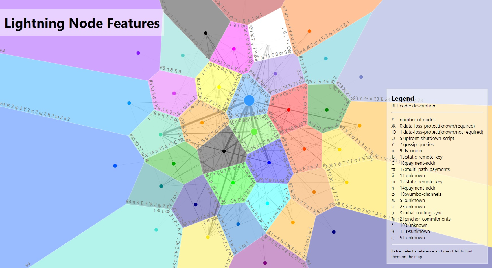

## Lightning Map

This project is a sample visualization of a section of the lightning network.

On startup, it looks like this:


The text around each shaded area specifies the number of nodes and a the sum of the features.

Each feature reference has the number of nodes after it. This makes it easier to detect a network which mostly implements a specific feature. If a network doesn't use a feature at all, that reference will be missing, which is easy to spot.

You may select an item in the legend and using ctrl-f or cmd-f in your browser, find which apply.

It looks like this:


At the moment, the api/features endpoint is limiting to colors with > 3 nodes in them. This can be changed with limitByCountValue. Also, edges can be made more prominent by changing the value of linkScale.

It is a next.js/react app and the d3 aspect is in plain js. Projects such as Vega, Victory, and Recharts didn't seem to have suffient examples applicable to this kind of data. I would be happy to create a similar pure-react version, although it would go over the time for this exercise.

To run the development server:

```bash
npm i
npm run dev
# or
yarn dev
# or
docker build -t client . && docker run -p 3000:3000 client
```
